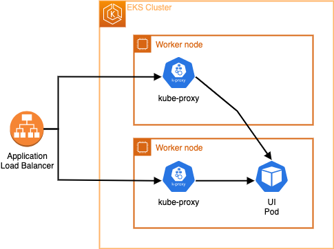

:::tip Before you start
Prepare your environment for this section:

```bash timeout=300 wait=30
$ reset-environment 
```

:::

Kubernetes uses services to expose pods outside of the cluster. One of the most popular ways to use services in AWS is with the `LoadBalancer` type. With a simple YAML file declaring your service name, port, and label selector, the cloud controller will provision a load balancer for you automatically.

```yaml
apiVersion: v1
kind: Service
metadata:
  name: search-svc # the name of our service
spec:
  type: loadBalancer
  selector:
    app: SearchApp # pods are deployed with the label app=SearchApp
  ports:
    - port: 80
```

This is great because of how simple it is to put a load balancer in front of your application. The service spec been extended over the years with annotations and additional configuration. A second option is to use an ingress rule and an ingress controller to route external traffic into Kubernetes pods.



In this chapter we'll demonstrate how to expose an application running in the EKS cluster to the Internet using a layer 4 Network Load Balancer.