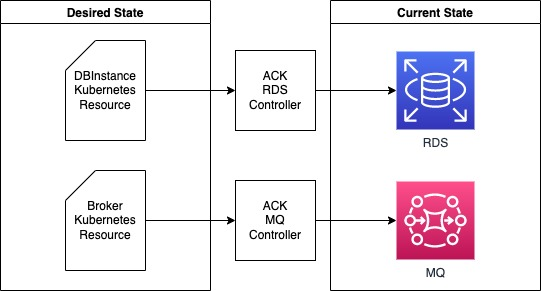

In this section we will provision a database and message broker for our application, we will use AWS managed services.
AWS managed service can be provision using Kubernetes API, we will use Kubernetes custom resources to specify the desire
configuration for the service we want to access form our application.




## Create RDS Database

Set DB master user password
```bash
$ kubectl create secret generic rds-eks-workshop --from-literal=password="$(date +%s | sha256sum | base64 | head -c 32)" --namespace default
secret/rds-eks-workshop created
```

Specify a Security Group manifest, this controls access to our database.
```file
ack/rds/k8s/rds-security-group.yaml
```
Specify a RDS DBSubnetGroup manifest, this configures the subnets that the database will be attach
```file
ack/rds/k8s/rds-dbgroup.yaml
```
Specify a RDS DBInstance manifest, this configures the database configuration like storage and engine.
```file
ack/rds/k8s/rds-instance.yaml
```

Create SecurityGroup, DBSubnetGroup, and DBInstance using the manifest files.
```bash
$ kubectl apply -k /workspace/modules/ack/rds/k8s
securitygroup.ec2.services.k8s.aws/rds-eks-workshop created
dbinstance.rds.services.k8s.aws/rds-eks-workshop created
dbsubnetgroup.rds.services.k8s.aws/rds-eks-workshop created
```
## Create Amazon MQ Broker 

Set Broker admin user password
```bash
$ kubectl create secret generic mq-eks-workshop --from-literal=password="$(date +%s | sha256sum | base64 | head -c 32)" --namespace default
secret/mq-eks-workshop created
```

Specify a Security Group manifest, this controls access to our message broker.
```file
ack/mq/k8s/mq-security-group.yaml
```
Specify the Amazon MQ Broker manifest
```file
ack/mq/k8s/mq-broker.yaml
```


Create Security Group and Amazon MQ Broker using the manifest files.
```bash
$ kubectl apply -k /workspace/modules/ack/mq/k8s
broker.mq.services.k8s.aws/mq-eks-workshop created
```

After 10 minutes you can see in the AWS Console the RDS and MQ resouces are available.

Continue to the next section to export the binding information from the provisioned AWS managed services.

