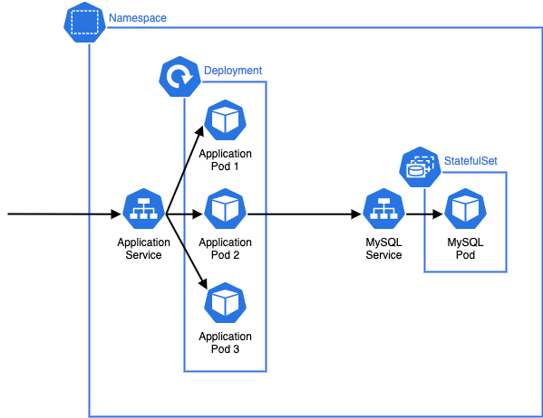
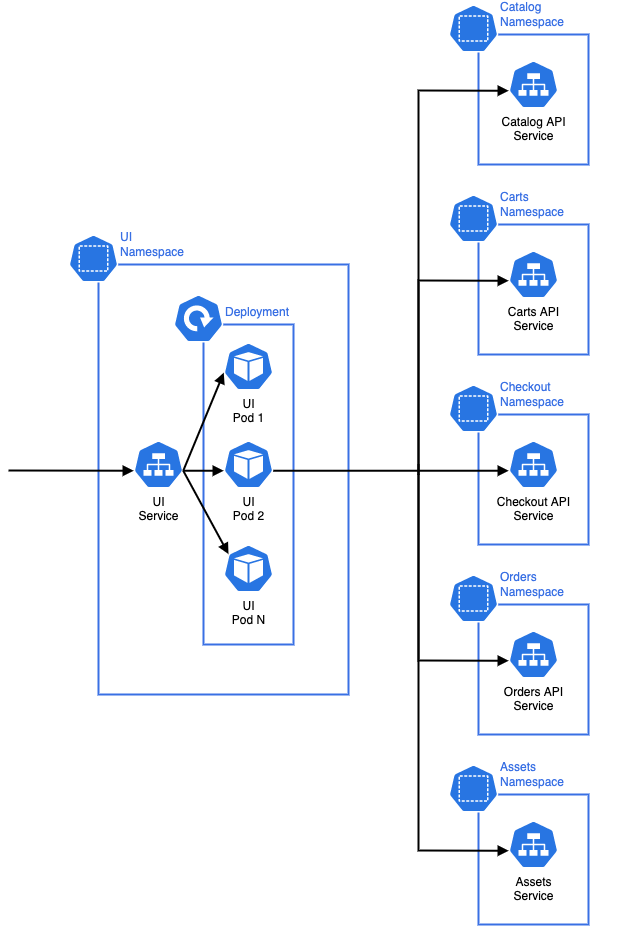

Now that we're familiar with the overall architecture of the sample application, how will we initially deploy this in to EKS? Lets explore some of the Kubernetes building blocks by looking at the **catalog** component:

There are a number of things to consider in this diagram:

* The application that provides the catalog API runs as a [Pod](https://kubernetes.io/docs/concepts/workloads/pods/), which is the smallest deployable unit in Kubernetes. Application Pods will run the container images we outlined in the previous section.
* The Pods that run for the catalog component are created by a [Deployment](https://kubernetes.io/docs/concepts/workloads/controllers/deployment/) which may manage one or more "replicas" of the catalog Pod, allowing it to scale horizontally.
* A [Service](https://kubernetes.io/docs/concepts/services-networking/service/) is an abstract way to expose an application running as a set of Pods, and this allows our catalog API to be called by other components inside the Kubernetes cluster. Each Service is given its own DNS entry.
* We are starting this workshop with a MySQL database that runs inside our Kubernetes cluster as a [StatefulSet](https://kubernetes.io/docs/concepts/workloads/controllers/statefulset/), which is designed to manage stateful workloads.
* All of these Kubernetes constructs are grouped in their own dedicated catalog Namespace. Each of the application components has its own Namespace.

Each of the components in the microservices architecture is conceptually similar to the catalog, using Deployments to manage application workload Pods and Services to route traffic to those Pods. If we expand out our view of the architecture we can consider how traffic is routed throughout the broader system:

The **ui** component receives HTTP requests from, for example, a users browser. It then makes HTTP requests to other API components in the architecture to fulfill that request and returns a response to the user. Each of the downstream components may have their own data stores or other infrastructure. The Namespaces are a logical grouping of the resources for each microservice and also act a soft isolation boundary which can be used to effectively implement controls using Kubernetes RBAC and Network Policies.