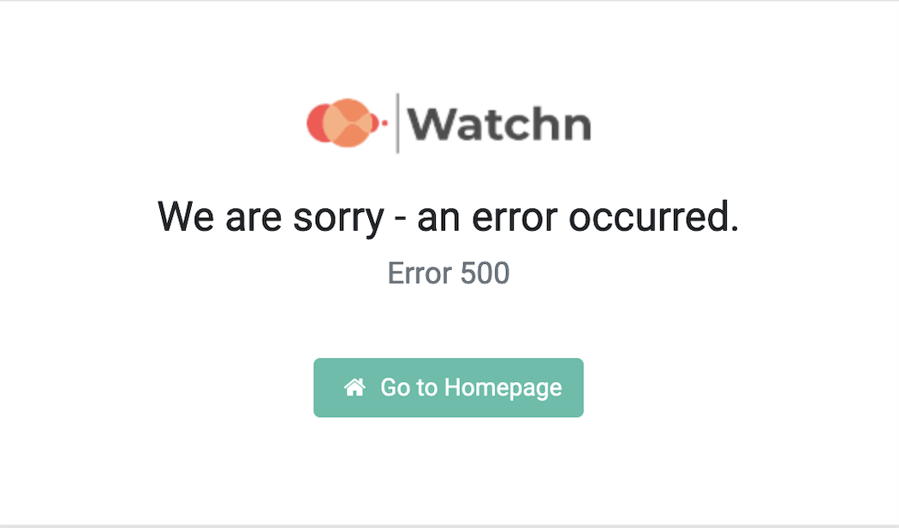

The first step in this process is to re-configure the `carts` service to use a DynamoDB table that has already been created for us. The application loads most of its confirmation from a `ConfigMap`, lets take look at it:

```bash
$ kubectl -n carts get -o yaml cm carts
apiVersion: v1
data:
  AWS_ACCESS_KEY_ID: key
  AWS_SECRET_ACCESS_KEY: secret
  CARTS_DYNAMODB_CREATETABLE: true
  CARTS_DYNAMODB_ENDPOINT: http://carts-dynamodb:8000
  CARTS_DYNAMODB_TABLENAME: Items
kind: ConfigMap
metadata:
  name: carts
  namespace: carts
```

Lets use Kustomize to change this configuration to use the real DynamoDB service:

```bash hook=enable-dynamo hookTimeout=430
$ kubectl apply -k /workspace/modules/security/irsa/dynamo
```

This will create a new `ConfigMap` which we can now take a look at:

```file
security/irsa/dynamo/carts-configMap.yaml
```

We've removed the DynamoDB endpoint configuration which tells the SDK to default to the real DynamoDB service instead of our test Pod. We've also provided it with the name of the DynamoDB table thats been created already for us.

It also re-configured the `cart` service to use this new `ConfigMap`:

```kustomization
security/irsa/dynamo/carts-deployment.yaml
Deployment/carts
```

Let us try to access our application using the browser. A `LoadBalancer` type service named `ui-nlb` is provisioned in the `ui` namespace usig which the application's UI can be accessed.

```bash
$ kubectl get service -n ui ui-nlb -o jsonpath="{.status.loadBalancer.ingress[*].hostname}"
k8s-ui-uinlb-647e781087-6717c5049aa96bd9.elb.us-west-2.amazonaws.com
```
So now our application should be using DynamoDB right? Load it up in the browser using the output of the above command and navigate to the shopping cart:



Carts service is not accessible! What's gone wrong?