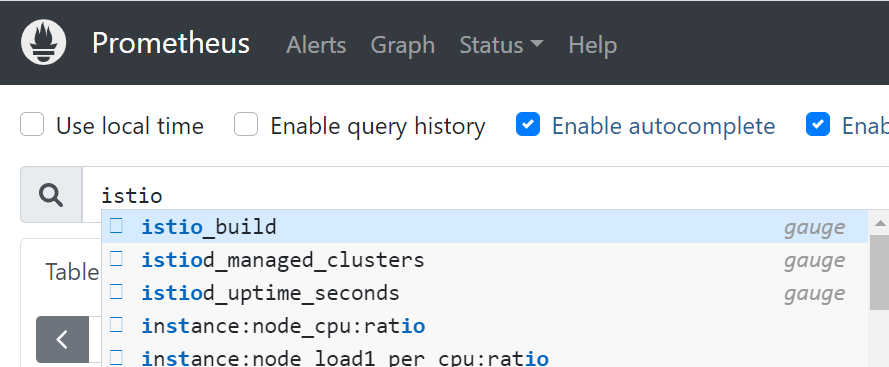
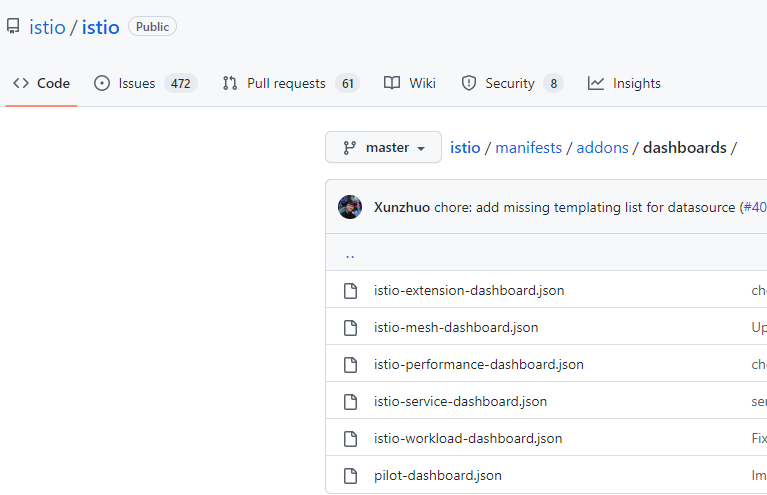
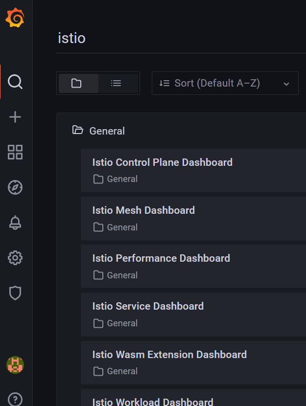
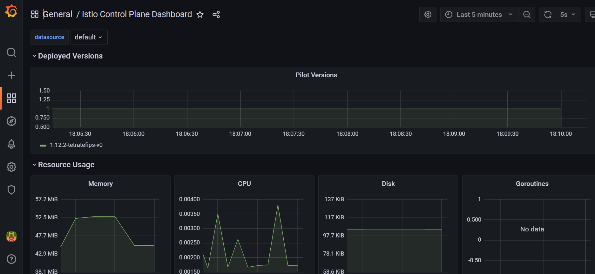

In this section, you configure Prometheus-Operator resources to scrape metrics from Istio to Prometheus and install the Grafana Dashboards.

In the following step, you deploy a ServiceMonitor resource that describes which pods to scrape based on a Service. In Istio, we have two types of things to monitor: Istio control-plane resources and Istio-proxy data-plane. For that we create 2 different ServiceMonitor resources.


### Configuring Prometheus operator to monitor Istio control plane
The following resource is to configure Prometheus operator to monitor Istio control plane by looking for any service with label istio equal to `[mixer,pilot,galley,citadel,sidecar-injector]` and it configures it to scrap metrics from ports `http-monitoring` and `http-policy-monitoring` every 15 seconds.
```yaml
cat <<EOF | kubectl apply -f -
apiVersion: monitoring.coreos.com/v1
kind: ServiceMonitor
metadata:
  name: prometheus-oper-istio-controlplane
  labels:
    # The labels here are selectors that MUST match the Prometheus install serviceMonitorSelector. 
    # If you fail to do so, Prometheus will not consider this resource.
    release: prometheus
spec:
  jobLabel: istio

  # the spec.selector label tells Prometheus which services should be scraped. 
  # in this case it will be istiod, as it has the label istio with on of the following 
  # values [mixer,pilot,galley,citadel,sidecar-injector]   
  selector:
    matchExpressions:
      - {key: istio, operator: In, values: [mixer,pilot,galley,citadel,sidecar-injector]}

  # By default, Prometheus will only pick up ServiceMonitors from the current namespace. 
  # To select ServiceMonitors from other namespaces, you can update the 
  # spec.serviceMonitorNamespaceSelector field of the Prometheus resource.      
  namespaceSelector:
    any: true

  # Here it scrapes port named http-monitoring and http-policy-monitoring every 15s
  endpoints:
  - port: http-monitoring
    interval: 15s
  - port: http-policy-monitoring
    interval: 15s
EOF
```

The only thing to be careful about are the labels at the beginning of the preceeding ServiceMontor resource. Those lables are selectors that must match the serviceMonitorSelector property of the Prometheus resource running in the prometheus namespace . If you fail to do so, Prometheus will not consider this ServiceMonitor resource.

You can check how yours is configured by looking at the prometheus resource:

```shell
kubectl get prometheus -n prometheus -o yaml | grep -A4 serviceMonitorSelector    
```
Output:
```yaml
serviceMonitorSelector:
      matchLabels:
        release: prometheus
```
In my case, it is `release: prometheus` which matches the label of the ServiceMonitor resource above.


### Configuring Prometheus operator to monitor Istio data plane
The data-plane resource has the same configurations, but this time it targets all `Istio-Proxy` containers. It scraps metrics from port `http-envoy-prom` on the path `/stats/prometheus` every 15 seconds. In addition, it adds some relabeling.


```yaml
cat <<EOF | kubectl apply -f -
apiVersion: monitoring.coreos.com/v1
kind: ServiceMonitor
metadata:
  name: prometheus-oper-istio-dataplane
  labels:
    monitoring: istio-dataplane
    release: prometheus
spec:
  selector:
    matchExpressions:
      - {key: istio-prometheus-ignore, operator: DoesNotExist}
  namespaceSelector:
    any: true
  jobLabel: envoy-stats
  endpoints:
  - path: /stats/prometheus
    targetPort: http-envoy-prom
    interval: 15s
    relabelings:
    # The source labels select values from existing labels. Their content are matched 
    # against the configured regular expression or target label for the replace, keep, and drop actions.
    # For more info: 
    # https://prometheus.io/docs/prometheus/latest/configuration/configuration/#metric_relabel_configs
    - sourceLabels: [__meta_kubernetes_pod_container_port_name]
      # keep: Drop targets for which regex does not match the concatenated source_labels.
      action: keep
      regex: '.*-envoy-prom'
    - action: labelmap
      regex: "__meta_kubernetes_pod_label_(.+)"

      # Label to which the resulting value is written in a replace action.
      # It is mandatory for replace actions.
    - sourceLabels: [__meta_kubernetes_namespace]
      # replace: replace source label with the traget label
      action: replace
      targetLabel: namespace
    - sourceLabels: [__meta_kubernetes_pod_name]
      action: replace
      targetLabel: pod_name
EOF
```
Make sure you have the correct label to allow Prometheus Operator to manage the resource.

If you don't want Prometheus to scrape the Istio-proxy's metrics, add the label `istio-prometheus-ignore=”true”` to your deployments.

### Checking Prometheus for Istio Metrics:
Wait a few seconds from deploying the preceeding two ServiceMonitor resources, then connect to your Prometheus LB endpoint, and search istio metrics.



### Enabling Istio dashboard in Grafana
Now, you may want to see Istio metrics presented in graphs within Grafana, and for that purpose, you can find Istio dashboards stored in [Istio Github repo](https://github.com/istio/istio/tree/master/manifests/addons/dashboards). 




Create a directory and download them all into that directory
```shell
mkdir dashboards
cd dashboards
curl -o ./istio-extension-dashboard.json https://raw.githubusercontent.com/istio/istio/master/manifests/addons/dashboards/istio-extension-dashboard.json 
curl -o ./istio-mesh-dashboard.json https://raw.githubusercontent.com/istio/istio/master/manifests/addons/dashboards/istio-mesh-dashboard.json 
curl -o ./istio-performance-dashboard.json https://raw.githubusercontent.com/istio/istio/master/manifests/addons/dashboards/istio-performance-dashboard.json 
curl -o ./istio-service-dashboard.json https://raw.githubusercontent.com/istio/istio/master/manifests/addons/dashboards/istio-service-dashboard.json 
curl -o ./istio-workload-dashboard.json https://raw.githubusercontent.com/istio/istio/master/manifests/addons/dashboards/istio-workload-dashboard.json 
curl -o ./pilot-dashboard.json https://raw.githubusercontent.com/istio/istio/master/manifests/addons/dashboards/pilot-dashboard.json 
```

After downloading them, you need to copy them inside a kubernetes configmap. assuming you are in the same directory having the dashoards, run the following command into it.
```shell
kubectl -n prometheus create cm istio-dashboards \
--from-file=pilot-dashboard.json=./pilot-dashboard.json \
--from-file=istio-workload-dashboard.json=./istio-workload-dashboard.json \
--from-file=istio-service-dashboard.json=./istio-service-dashboard.json \
--from-file=istio-performance-dashboard.json=./istio-performance-dashboard.json \
--from-file=istio-mesh-dashboard.json=./istio-mesh-dashboard.json \
--from-file=istio-extension-dashboard.json=./istio-extension-dashboard.json
```

Label the configmap so it is used by Grafana
```shell
kubectl label -n prometheus cm istio-dashboards grafana_dashboard=1
```

Redeploy the Grafana pod by deleting it; the prometheus-grafana deployment will recreate it for you. 

```shell
kubectl delete pod -n prometheus -l app.kubernetes.io/name=grafana
```

Wait seconds before re-logging to Grafana LB endpoint, and you should see the Dashboards in Grafana.

