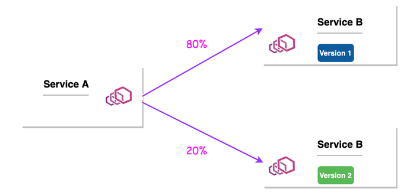
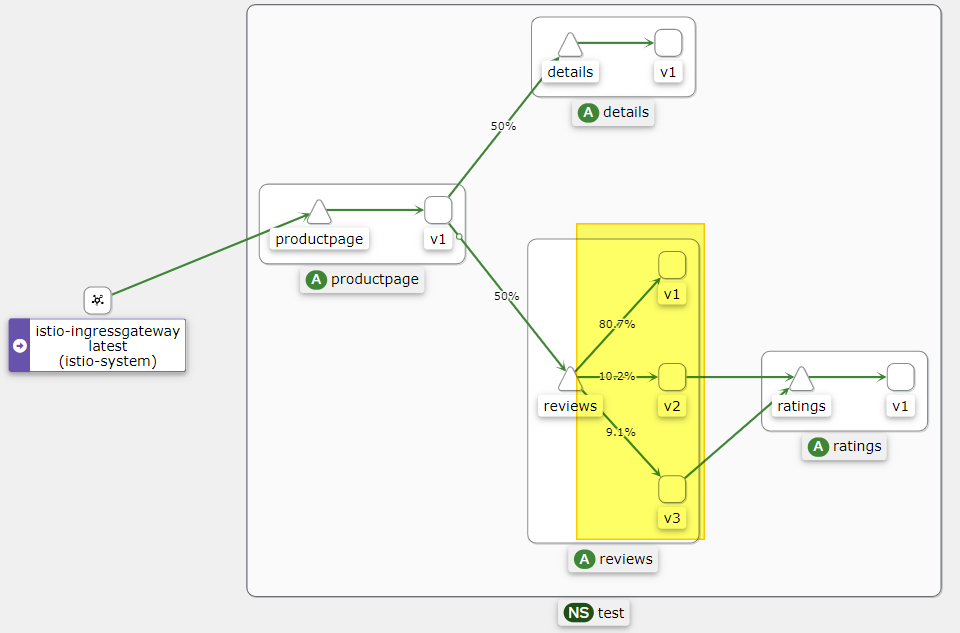

One of the *productpage*'s backend services is *reviews*. The reviews comes in three different pod versions, which are created from three separate deployments. All versions labeled with `app=reviews` which is the selector used in the reviews service.

```shell
kubectl get pods -n test -l app=reviews
```
Output:
```shell
NAME                          READY   STATUS    RESTARTS   AGE
reviews-v1-9c6bb6658-s97gt    2/2     Running   0          5h32m
reviews-v2-8454bb78d8-f9r25   2/2     Running   0          5h32m
reviews-v3-6dc9897554-5fnqp   2/2     Running   0          5h32m
```

As a result, when you hit the product page, kubernetes will just distribute traffic equally to all versions as you see in the output of the following loop command. 
```shell
for i in {1..6}; do curl -s $ISTIO_IG_HOSTNAME/productpage | grep "reviews-" & sleep 1; done
```

Output:
```shell
[1] 3935
        <u>reviews-v1-9c6bb6658-s97gt</u>
[1]+  Done                    curl -s $ISTIO_IG_HOSTNAME/productpage | grep --color=auto "reviews-"
[1] 3998
        <u>reviews-v2-8454bb78d8-f9r25</u>
[1]+  Done                    curl -s $ISTIO_IG_HOSTNAME/productpage | grep --color=auto "reviews-"
[1] 4101
        <u>reviews-v1-9c6bb6658-s97gt</u>
[1]+  Done                    curl -s $ISTIO_IG_HOSTNAME/productpage | grep --color=auto "reviews-"
[1] 4111
        <u>reviews-v3-6dc9897554-5fnqp</u>
[1]+  Done                    curl -s $ISTIO_IG_HOSTNAME/productpage | grep --color=auto "reviews-"
[1] 4121
        <u>reviews-v2-8454bb78d8-f9r25</u>
[1]+  Done                    curl -s $ISTIO_IG_HOSTNAME/productpage | grep --color=auto "reviews-"
[1] 4169
        <u>reviews-v3-6dc9897554-5fnqp</u>
[1]+  Done                    curl -s $ISTIO_IG_HOSTNAME/productpage | grep --color=auto "reviews-"
```

Now, let's open **Kiali**. Get the DNS name of the AWS ALB of Kilai, then hit it in the browser.


Navigate to *Graph* in the Kiali dashboard. Choose the *test* namespace next. Then, in the display dropdown, tick the boxes next to "Traffic Animation" and "Traffic Distribution". Finally, set the *Traffic metric per refresh* to **Last 5m**, and the *Refresh interval* to **Every 10s**.

Now, execute the same loop command again for enough time and while the loop is running, check how Kiali shows the distribution of traffic to the 3 pod versions of the reviews service, which should still be almost equally distributed.
```shell
for i in {1..300}; do curl -s $ISTIO_IG_HOSTNAME/productpage | grep "reviews-" & sleep 1; done
```

Wait a minute, and then you will notice that the traffic to the reviews versions are distributed amost equally. 

You now understand the behavior of Kubernetes when distributing traffic to different versions of service backend pods. But the question now is, how to route traffic to each version by percentage of the coming taffic? 


For example, the reviews service backed by 3 different versions. Is it possible to route 80% of traffic to v1, 10% to v2, and 10% to v3?

Yes, you can easily accomplish this with Istio by creating a `VirtualService` that lists the different versions subsets with their weights, and a `DestinationRule` that defines policies that apply to traffic intended for a service after routing has occurred.

Now, each deployment version is labeled with the label `version`, but with a different value. For example deployment of version 1, has the version label defined like this `version=v1`, and deployment of version 2, has the version label defined like this `version=v2`, etc.

For example, if you want to list reviews pods of version 1, run the following command:
```shell
kubectl get pod -n test -l version=v1 | grep reviews
```
Output:
```shell
reviews-v1-9c6bb6658-s97gt       2/2     Running   0          22h
```

Now, let's define a subset per version using a DestinationRule. The label attached to the pods of each version must match the label defined here for each subset.

```yaml
kubectl apply -n test -f - <<EOF
apiVersion: networking.istio.io/v1alpha3
kind: DestinationRule
metadata:
  name: reviews
spec:
  host: reviews # reviews.<namespace>.svc.cluster.local
  subsets: 
  - name: v1
    labels:
      version: v1 # This is a label attached to the pods of version 1.
  - name: v2
    labels:
      version: v2 # This is a label attached to the pods of version 2.
  - name: v3
    labels:
      version: v3 # This is a label attached to the pods of version 3.
EOF
```


For the weight-based routing to happen, you create a VirtualService where you define a routing rule per version. Weights associated with the version determine the proportion of traffic it receives. For example, the rules defined here will route 80% of traffic for the “reviews” service to instances with the “v1” label 10% of traffic for "v2", and the remaining 10% for "v3".

```yaml
kubectl apply -n test -f - <<EOF
apiVersion: networking.istio.io/v1alpha3
kind: VirtualService
metadata:
  name: reviews
spec:
  hosts:
  - reviews # reviews.<namespace>.svc.cluster.local
  gateways: 
    # Here you bind this virtualService to the gateway bookinfo-gateway, and to the whole mesh. 
    # Which means that the rules of this virtualservice will apply to this gateway level, and to the whole mesh. 
  - bookinfo-gateway 
  - mesh 
  http: 
  - route:
    - destination:
        host: reviews
        subset: v1
      weight: 80 
    - destination:
        host: reviews
        subset: v2
      weight: 10
    - destination:
        host: reviews
        subset: v3
      weight: 10
EOF
```

Now, execute the same loop command you executed earlier. 
```shell
for i in {1..300}; do curl -s $ISTIO_IG_HOSTNAME/productpage | grep "reviews-" & sleep 1; done
```

Wait a minute, and then Open Kiali to look at the distribution of traffic to the 3 pod versions of the reviews service, 

This time, the traffic to the reviews versions are distributed following the weight based rules we defined in the VirtualService. 


You can also use this weight-based method to gradually `traffic shifting` from one version to another, or to have `Canary Deployment` to test a newer version of a service by incrementally rolling out to users to minimize the risk and impact of any bugs introduced by the newer version. 
