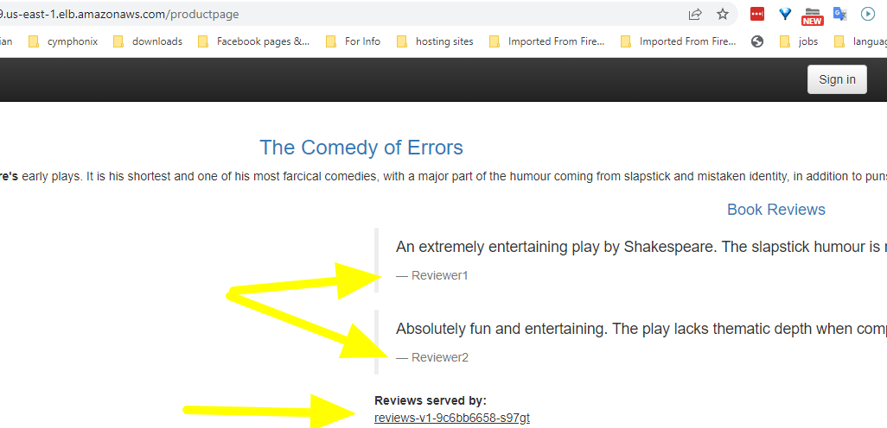

In this task, you use Istio to send 100% of the traffic to `reviews-v1`. You then set a rule to selectively send traffic to `reviews-v2` based on a custom end-user header added to the request by the productpage service. In this case, all traffic from a user named *tester* will be routed to the service `reviews:v2`, but all remaining traffic goes to `reviews-v1`.

`reviews:v1` is the version that does not include the star ratings feature. `reviews:v2` is the version that includes the star ratings feature.

Run the following command to re-configure the virtualService reviews you created in the previous task with the following one to enable user-based routing:

```yaml
kubectl apply -n test -f - <<EOF
apiVersion: networking.istio.io/v1alpha3
kind: VirtualService
metadata:
  name: reviews
spec:
  hosts: 
  - reviews
  
  # When this field is omitted, the default gateway (mesh) will be used, which would apply the rules to all sidecars in the mesh. 
  # If a list of gateway names is provided, the rules will apply only to those gateways. 
  # To apply the rules to both gateways and sidecars, specify mesh as one of the gateway names.
  gateways:
  - bookinfo-gateway
  - mesh
  http: 
  - match: 
    - headers:
        end-user:
          exact: tester
    route:
    - destination:
        host: reviews
        subset: v2
      weight: 100
  - route:
    - destination:
        host: reviews
        subset: v1      
EOF
```
Now, let's open the productpage using the browser:
```shell
echo $ISTIO_IG_HOSTNAME/productpage
```
Output:
```shell
ac8bed13fd78247e995b42664063ce47-1403049919.us-east-1.elb.amazonaws.com/productpage
```
Notice here before logging, that the displayed page shows `reviews-v1` and does not includes the star ratings feature.


Now, let's see what happens when logging with the *tester* user?

Hit the `Sign In` button, to log in with the `tester` user, with no password:


Once the tester user is in, you will notice that the displayed page include the star ratings feature and show `reviews-v2` as it's expected.


And if you singed out and signed in back with any user other than *tester* (pick any name you wish). You will see that review stars are not there and it shows reviews-v1. This is because traffic is routed to reviews:v1 for all users except tester.


You have successfully configured Istio to route traffic based on user identity.

**Try it out:** Change the routing rule to direct tester user to v1, and remaining traffic to goes to v2.


